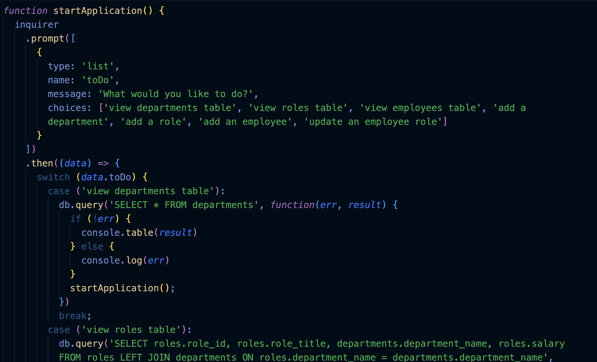

# Employee-Tracker

## Description:

This application uses input from the user via command-line/terminal prompts using inquirer to track and add employee data.
  - I built this project to practise using sql databases and to access data from them locally.
  - Making this project I learned how to use joins for combining multiple table columns.
  
## Installation:
This project can be cloned into your project.

## Usage:

A tutorial demonstration for this application can be viewed here: https://youtu.be/G8ySKoR8nV4

This project can be used by running 'node app.js' in the command-line or terminal. Then answer all prompts using the arrow/enter keys.

## Credits:
This project is my own.

## License:
MIT license.
